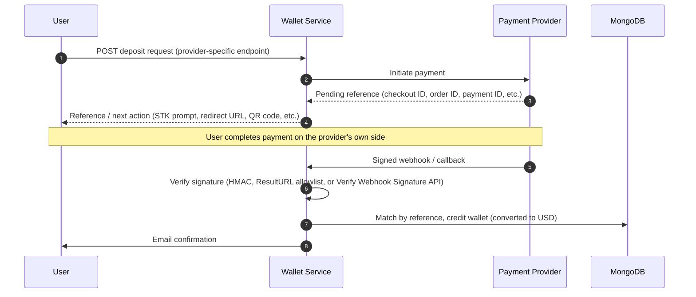
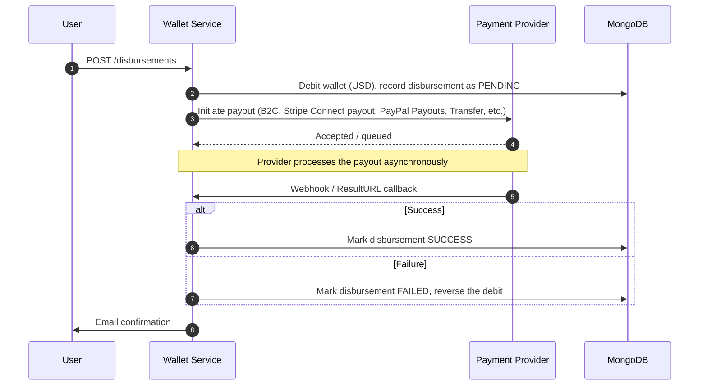
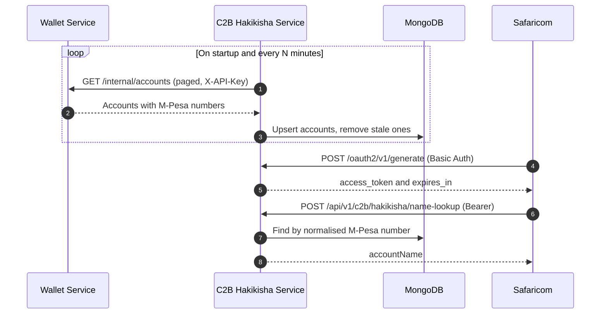

<p align="center">
  
</p>

<h1 align="center">Premisave Wallet Service: Multi-Provider Digital Wallet &amp; Payment Orchestration API</h1>

<p align="center">
  <b>A production-minded Spring Boot 4 &amp; MongoDB microservice that unifies M-Pesa, Stripe, PayPal, Flutterwave, and NOWPayments behind a single, USD-denominated wallet API for the Premisave fintech platform.</b>
</p>

<p align="center">
  <a href="https://github.com/peacemakerbill">
    
  </a>
  <br/>
  <sub>Built by <a href="https://github.com/peacemakerbill"><b>Bill Graham Peacemaker</b></a> (<code>@peacemakerbill</code>) · Backend Developer &amp; API Support Engineer · Nairobi, Kenya</sub>
</p>

<p align="center">
  
  
  
  
  
  
</p>

<p align="center">
  
  
  
  
  
</p>

<p align="center">
  <a href="https://github.com/peacemakerbill/premisave-wallet-service/stargazers"></a>
  <a href="https://github.com/peacemakerbill/premisave-wallet-service/network/members"></a>
  <a href="https://github.com/peacemakerbill/premisave-wallet-service/issues"></a>
  <a href="https://github.com/peacemakerbill/premisave-wallet-service/commits"></a>
  
  
  
</p>

<p align="center">
  <a href="#quick-start">Quick start</a> ·
  <a href="#architecture">Architecture</a> ·
  <a href="#how-deposits-work-all-providers">How deposits work</a> ·
  <a href="#how-disbursements-work-all-providers">How disbursements work</a> ·
  <a href="#api-reference">API reference</a> ·
  <a href="#configuration-reference">Configuration</a> ·
  <a href="#troubleshooting">Troubleshooting</a>
</p>

> **If this saves you time integrating multi-provider payments in Java, please star the repo.** It helps other Kenyan fintech developers find it.

> **Disclaimer.** This is an independent, community-built project shared as a portfolio and reference implementation. It is not an official product of, and is not affiliated with or endorsed by, Safaricom, Stripe, PayPal, Flutterwave, or NOWPayments. M-PESA is a trademark of Safaricom PLC. Always follow each provider's own current documentation for onboarding and go-live requirements.

---

## Table of contents

1. [What is this?](#what-is-this)
2. [Features](#features)
3. [Supported payment providers](#supported-payment-providers)
4. [Architecture](#architecture)
5. [How deposits work (all providers)](#how-deposits-work-all-providers)
6. [How disbursements work (all providers)](#how-disbursements-work-all-providers)
7. [Currency and ledger model](#currency-and-ledger-model)
8. [Quick start](#quick-start)
9. [Build and run](#build-and-run)
10. [Configuration reference](#configuration-reference)
11. [API reference](#api-reference)
12. [Testing with Postman or curl](#testing-with-postman-or-curl)
13. [Admin and financial reporting](#admin-and-financial-reporting)
14. [Data model](#data-model)
15. [Going live](#going-live)
16. [Security notes](#security-notes)
17. [Project structure](#project-structure)
18. [Troubleshooting](#troubleshooting)
19. [Roadmap ideas](#roadmap-ideas)
20. [Contributing](#contributing)
21. [Author](#author)

---

## What is this?

**Premisave Wallet Service** is the financial backbone of the Premisave platform: a Java Spring Boot microservice that gives every user one wallet, held in one currency (USD), regardless of which of five independent payment rails actually moved the money.

Each payment gateway has its own currency conventions, its own callback shape, its own idea of what "success" means, and its own asynchronous timing. Rather than letting that complexity leak into every other Premisave microservice, this project absorbs it entirely. It:

- exposes one consistent wallet API for deposits, disbursements, transfers, and payments, regardless of which provider is behind a given request,
- converts every provider's native settlement currency to USD at the moment money enters or leaves the wallet, using a live, cached exchange rate,
- reconciles every provider's asynchronous webhook or callback against the original transaction by an idempotency reference, so a retried delivery can never double-credit or double-debit a wallet,
- gives platform admins one place to see how much money moved, how much the platform earned, and which operations still need manual follow-up.

It was built for the Premisave platform's own microservice ecosystem (alongside `auth-service` and `property-service`), but the provider-integration boundary is isolated per service class, so adding a sixth payment rail does not require touching the wallet-crediting logic itself.

## Features

| | |
|---|---|
| **Unified USD wallet** | Every balance is held in USD as ground truth, regardless of which currency a provider actually settles in. |
| **Five payment providers, one API** | M-Pesa (STK Push, C2B, B2C, B2B, B2Pochi, Reversal, Account Balance, Transaction Status, Pull Transactions), Stripe (PaymentIntents, saved cards, Stripe Connect), PayPal (Orders, vaulting, Payouts), Flutterwave v4, NOWPayments crypto. |
| **Live currency conversion** | Scheduled background refresh from the Frankfurter API, cached in Redis and MongoDB, covering 160+ currency pairs. |
| **Wallet-to-wallet transfers** | Instant internal transfers between Premisave users, fully commission-tracked. |
| **Direct payment processing** | Subscription- and booking-fee-style payments where the full amount is recorded as company revenue, not a percentage cut. |
| **Webhook-driven reconciliation** | Signature-verified callback handling for every provider, with idempotent processing and raw-payload audit logging. |
| **Admin financial reporting** | Daily reports, all-time system summary, balance overview, and gateway reconciliation, all normalized to USD. |
| **Automated email notifications** | Deposit, disbursement, transfer, and payment confirmations with resolved sender and recipient names. |
| **Dual authentication model** | JWT for end users, a shared internal API key for service-to-service calls from the rest of the Premisave ecosystem. |
| **Rate limiting** | Token-bucket request throttling via Bucket4j. |
| **OpenAPI 3 documentation** | Full API spec generation via springdoc-openapi. |

## Supported payment providers

| Provider | Deposits | Disbursements | Notes |
|---|:---:|:---:|---|
| **M-Pesa (Safaricom Daraja)** | Yes | Yes | STK Push, C2B, B2C, B2B, B2Pochi, Reversal, Account Balance, Transaction Status, Pull Transactions |
| **Stripe** | Yes | Yes | PaymentIntents, saved cards, Stripe Connect for cross-border payouts |
| **PayPal** | Yes | Yes | Orders API, vaulted payment methods, Payouts API |
| **Flutterwave (v4)** | Yes | Yes | Charges and Transfers |
| **NOWPayments** | Yes | Yes | Cryptocurrency deposits and payouts |

## Architecture

```
┌──────────────┐      JWT       ┌────────────────────────┐
│   End User   │ ─────────────► │                        │
└──────────────┘                │                        │      ┌─────────────┐
                                 │   Premisave Wallet     │ ───► │  M-Pesa     │
┌──────────────┐  X-API-Key     │      Service            │ ───► │  Stripe     │
│ auth-service │ ◄────────────► │  (this repository)     │ ───► │  PayPal     │
├──────────────┤                │                        │ ───► │ Flutterwave │
│property-serv.│ ◄────────────► │  MongoDB <-> Redis     │ ───► │ NOWPayments │
├──────────────┤                │                        │      └─────────────┘
│c2b-hakikisha │ ─── reads ───► │  /internal/accounts    │
└──────────────┘                └────────────────────────┘
```

**Design choices**

- **One wallet-crediting/debiting path, five thin provider integrations.** Every provider's own service class is responsible only for translating that provider's own initiation call and webhook payload into the same shared, currency-converted deposit/disbursement pipeline.
- **The webhook is the source of truth, never the initiation response.** A provider's initiation call only ever returns a pending reference — the wallet is only credited or the disbursement only finalized once a signed webhook confirms the outcome.
- **Sibling services never call payment providers directly.** `auth-service` and `property-service` reach payment functionality only through this service's `/internal/**` API, keyed by a shared internal API key.

## How deposits work (all providers)



This single shape covers M-Pesa STK Push, Stripe PaymentIntents, PayPal Orders, Flutterwave Charges, and NOWPayments crypto deposits. Only the provider-specific initiation call and callback payload shape differ; the reconciliation pattern itself does not.

| Provider | Initiation | Webhook signal | Signature verification |
|---|---|---|---|
| M-Pesa | STK Push (`/mpesa/stkpush`) or Pull Transactions | Safaricom ResultURL callback | IP allowlist at gateway/firewall level |
| Stripe | PaymentIntent creation | `payment_intent.succeeded` webhook event | Stripe webhook signing secret |
| PayPal | Order creation | `CHECKOUT.ORDER.APPROVED` / `PAYMENT.CAPTURE.COMPLETED` webhook | PayPal Verify Webhook Signature API |
| Flutterwave | Charge creation | `charge.completed` webhook | HMAC-SHA256 over the raw body |
| NOWPayments | Payment creation | IPN callback with `payment_id` | HMAC-SHA512 over the sorted JSON body |

## How disbursements work (all providers)



This same shape covers M-Pesa B2C/B2Pochi/B2B, Stripe Connect payouts, PayPal Payouts, Flutterwave Transfers, and NOWPayments payouts. The wallet is debited optimistically at initiation and only ever refunded if the provider later reports failure, never left in an ambiguous state.

### Example integration: C2B Hakikisha name lookup

A concrete example of the `/internal/**` API in action, beyond deposits and disbursements: the sibling **C2B Hakikisha** service (Safaricom's M-Pesa name-lookup API) polls this service's `GET /internal/accounts` endpoint to keep its own copy of M-Pesa and Pochi phone numbers in sync, then answers Safaricom's name-lookup requests entirely from its own local database. This service is never called synchronously in that hot path.



## Currency and ledger model

- **USD is the only currency a `Wallet` document ever stores.** Conversion happens once, at the point money enters or leaves the system, using the exchange rate in effect at that moment. Admin reporting never has to reconcile mixed-currency totals.
- **Exchange rates** are sourced from the [Frankfurter API](https://www.frankfurter.app/) (ECB reference rates), refreshed on a schedule, and cached in Redis (fast path) and MongoDB (durable fallback and historical record) — 160+ pairs tracked.
- **Every revenue-generating operation** — gateway disbursement commissions, internal transfer commissions, and direct payment revenue — is recorded as a `CompanyLedgerEntry`, always normalized to USD, powering the admin financial reports.
- **Idempotency**: every deposit, disbursement, transfer, and payment carries a `reference`, either caller-supplied or an auto-generated UUID, checked before any money movement happens.

## Quick start

### Prerequisites

- **Java 21**
- **Maven 3.9+**
- **MongoDB** running locally, in Docker, or on Atlas
- **Redis** running locally or hosted
- Sandbox/developer credentials for whichever payment providers you intend to test (M-Pesa Daraja, Stripe, PayPal, Flutterwave, NOWPayments)

```bash
# 1. Clone
git clone https://github.com/peacemakerbill/premisave-wallet-service.git
cd premisave-wallet-service

# 2. Start MongoDB and Redis (skip if you already have them)
docker run -d --name wallet-mongo -p 27017:27017 mongo:8
docker run -d --name wallet-redis -p 6379:6379 redis:7

# 3. Create your .env (see the next section), then run
mvn spring-boot:run
```

Create a `.env` file next to `pom.xml`:

```properties
# Core
MONGODB_URI=mongodb://localhost:27017/premisave-wallet
REDIS_HOST=localhost
REDIS_PORT=6379
JWT_SECRET=<a long, random secret shared with auth-service>
INTERNAL_API_KEY=<a shared secret, identical across every Premisave microservice>

# Auth Service Integration
AUTH_SERVICE_URL=http://localhost:8080

# M-Pesa Daraja
MPESA_CONSUMER_KEY=...
MPESA_CONSUMER_SECRET=...
MPESA_SHORTCODE=...
MPESA_PASSKEY=...
MPESA_CALLBACK_URL=...

# Stripe / PayPal / Flutterwave / NOWPayments
STRIPE_SECRET_KEY=...
PAYPAL_CLIENT_ID=...
FLUTTERWAVE_CLIENT_ID=...
NOWPAYMENTS_API_KEY=...
```

> **Important:** write `.env` values without quotes and without trailing spaces. Provider callback URLs (`MPESA_CALLBACK_URL` and similar) must be real, publicly reachable HTTPS URLs even in sandbox testing — a tunnel such as ngrok or Cloudflare Tunnel works for local development.

When the service is healthy you will see lines like:

```
Tomcat started on port 8084 (http) with context path '/'
M-Pesa access token generated successfully: expiresInSeconds=3599
Exchange rate refresh complete: 166 refreshed, 0 failed
```

## Build and run

```bash
# Compile and package an executable jar
mvn clean package

# Run it (environment variables or a .env in the working directory)
java -jar target/premisave-wallet-service-0.0.1-SNAPSHOT.jar
```

**Notes**

- `.env` is loaded from the working directory. Real environment variables (Docker, Kubernetes, systemd) also work and take precedence over `.env`.
- The service starts on **port 8084** by default (`server.port` in `application.yml`).

## Configuration reference

Every setting lives in `src/main/resources/application.yml` and can be overridden by an environment variable or `.env`.

| Environment variable | Default | Required | Description |
|---|---|---|---|
| `MONGODB_URI` | `mongodb://localhost:27017/premisave-wallet` | no | MongoDB connection string. |
| `REDIS_HOST` / `REDIS_PORT` | `localhost` / `6379` | no | Redis connection for exchange-rate caching and rate limiting. |
| `JWT_SECRET` | dev default | **yes in production** | Must match every other Premisave service validating the same tokens. |
| `INTERNAL_API_KEY` | none | **yes** | Shared secret every Premisave microservice presents as `X-API-Key` when calling this service's `/internal/**` endpoints, and this service presents when calling out to `auth-service`. |
| `AUTH_SERVICE_URL` | `http://localhost:8080` | no | Base URL of the auth-service used for user detail lookups. |
| `RATE_LIMIT_REQUESTS_PER_MINUTE` | `60` | no | Token-bucket capacity per client. |
| `MPESA_CONSUMER_KEY` / `MPESA_CONSUMER_SECRET` | none | **yes** | Daraja app credentials. |
| `MPESA_SHORTCODE` / `MPESA_PASSKEY` | none | **yes** | STK Push shortcode and passkey. |
| `MPESA_CALLBACK_URL` | none | **yes** | Public HTTPS URL for the STK Push callback. |
| `MPESA_B2C_*` / `MPESA_B2B_*` / `MPESA_POCHI_*` | none | **yes, per channel used** | Initiator name/password, shortcode, and result/timeout URLs per disbursement channel. |
| `STRIPE_SECRET_KEY` | none | **yes** | Stripe API secret key. |
| `STRIPE_WEBHOOK_SECRET` | none | **yes** | Platform webhook signing secret. |
| `STRIPE_CONNECT_WEBHOOK_SECRET` | none | yes, if using Stripe Connect payouts | Separate webhook destination for connected-account payout events. |
| `PAYPAL_CLIENT_ID` / `PAYPAL_CLIENT_SECRET` | none | **yes** | PayPal REST app credentials. |
| `PAYPAL_WEBHOOK_ID` | none | **yes** | Required for PayPal's Verify Webhook Signature API. |
| `FLUTTERWAVE_CLIENT_ID` / `FLUTTERWAVE_CLIENT_SECRET` | none | **yes** | Flutterwave v4 app credentials. |
| `FLUTTERWAVE_WEBHOOK_SECRET_HASH` | none | **yes** | Key used to HMAC-verify the `flutterwave-signature` header. |
| `NOWPAYMENTS_API_KEY` | none | **yes** | NOWPayments API key. |
| `NOWPAYMENTS_IPN_SECRET` | none | **yes** | IPN callback signature secret. |
| `COMMISSION_INTERNAL_TRANSFER_RATE` | `0.01` | no | Commission rate on wallet-to-wallet transfers. |
| `COMMISSION_GATEWAY_RATE` | `0.03` | no | Commission rate on gateway-bound disbursements. |
| `EXCHANGE_RATE_REFRESH_INTERVAL_MS` | `1200000` (20 min) | no | How often previously-used currency pairs are refreshed. |
| `B2B_NOTIFICATION_RECIPIENTS` | none | no | Comma-separated admin/finance emails notified on every M-Pesa B2B outcome. |
| `FRONTEND_URL` | `http://localhost:3000` | no | Allowed CORS origin. |

The service **refuses to start** if `INTERNAL_API_KEY` is missing, by design.

## API reference

Base URL (local): `http://localhost:8084`

The service exposes REST endpoints under four broad namespaces:

| Namespace | Auth | Purpose |
|---|---|---|
| `/wallet/**` | JWT | Wallet operations, transfers, linked payment methods |
| `/payments/**` | JWT + public webhooks | Payment initiation and provider webhook callbacks |
| `/disbursements/**` | JWT | Withdrawal/payout initiation |
| `/admin/**` | JWT (Admin/Finance/Operations roles) | Financial reporting, reconciliation, manual adjustments |
| `/internal/**` | Internal API Key | Service-to-service calls from other Premisave microservices |

### `POST /payments/deduct`: deduct from the caller's own wallet

| | |
|---|---|
| **Header** | `Authorization: Bearer <JWT>` |

Request:

```json
{
  "amount": 5.00,
  "service": "AD_SUBSCRIPTION",
  "reference": "ad-sub-1758..."
}
```

Response (`200`):

```json
{
  "success": true,
  "message": "Payment processed",
  "data": {
    "success": true,
    "transactionId": "68f2a1b9c3d4e5f6a7b8c9d0",
    "message": "Payment successful"
  },
  "timestamp": "2026-09-19T14:22:01.123456"
}
```

### `POST /internal/payment`: deduct from a specified user's wallet

| | |
|---|---|
| **Header** | `X-API-Key: <INTERNAL_API_KEY>` |

Request:

```json
{
  "userId": "6a1621d0bf15ee8cbe8f24b5",
  "amount": 5.00,
  "service": "AD_SUBSCRIPTION",
  "description": "August 2026 ad subscription",
  "initiatedBy": "PROPERTY_SERVICE",
  "reference": "ad-sub-1758..."
}
```

Response shape is identical to `/payments/deduct` above — both endpoints share the same underlying processing method.

### `POST /wallet/transfer`: wallet-to-wallet transfer

| | |
|---|---|
| **Header** | `Authorization: Bearer <JWT>` |

Request:

```json
{
  "amount": 100.00,
  "recipientAccountNumber": "recipient@example.com",
  "description": "Rent split"
}
```

### `GET /internal/accounts`: wallet-owner directory

| | |
|---|---|
| **Header** | `X-API-Key: <INTERNAL_API_KEY>` |
| **Query** | `page` (default `0`), `size` (default `20`) |

Returns, per account: `userId`, `accountNumber`, `fullName`, `frozen`, `mpesaPhoneNumber`, `pochiPhoneNumber`, `paypalEmail`, `paypalConnectedEmail`, `stripeConnected`, `stripePayoutsEnabled`, `flutterwavePaymentMethodNetwork`, `flutterwavePaymentMethodPhone`, `createdAt`. Consumed by the sibling C2B Hakikisha service to keep its own M-Pesa/Pochi lookup table in sync.

## Testing with Postman or curl

```bash
BASE=http://localhost:8084
TOKEN="<a real JWT for a test user>"

# Deduct a payment from the caller's own wallet
curl -s -X POST "$BASE/payments/deduct" \
  -H "Authorization: Bearer $TOKEN" \
  -H "Content-Type: application/json" \
  -d '{"amount":5.00,"service":"AD_SUBSCRIPTION","reference":"ad-sub-test-1"}'

# Internal, service-to-service payment (no JWT)
curl -s -X POST "$BASE/internal/payment" \
  -H "X-API-Key: $INTERNAL_API_KEY" \
  -H "Content-Type: application/json" \
  -d '{"userId":"<user id>","amount":5.00,"service":"AD_SUBSCRIPTION","initiatedBy":"PROPERTY_SERVICE","reference":"ad-sub-test-2"}'

# List saved accounts (consumed by C2B Hakikisha)
curl -s -H "X-API-Key: $INTERNAL_API_KEY" "$BASE/internal/accounts?page=0&size=20"
```

**Collection variables worth saving in Postman:** `base_url_wallet`, `internal_api_key`, `jwt_token`, `test_user_id`, `test_recipient_email`.

## Admin and financial reporting

Beyond the core wallet API, the service exposes a dedicated admin surface (role-gated: `ADMIN`, `FINANCE`, `OPERATIONS`):

| Capability | What it answers |
|---|---|
| **Daily finance report** | Deposits, disbursements, transfers, and payment volume for a given day, plus that day's commission and direct-revenue breakdown, all in USD. |
| **System summary** | All-time platform totals: cumulative volume per transaction type, total commission revenue, total direct payment revenue since launch. |
| **Balance overview** | Total wallet liability across every user, plus which wallets have which payment methods linked. |
| **Gateway reconciliation** | A paginated, filterable audit trail of every M-Pesa API operation, including which never received a ResultURL callback and need manual follow-up. |
| **Manual wallet adjustments** | Admin-initiated balance corrections, fully audit-logged as their own ledger entry type, never a silent database edit. |

Every figure is normalized to USD, even where the underlying stored records span multiple provider currencies or predate a currency-handling fix.

## Data model

The `Wallet` document (one per user) carries the fields most integration partners need:

| Field | Purpose |
|---|---|
| `userId` / `accountNumber` | The owning user's ID and email. |
| `balance` / `currency` | Always USD. |
| `frozen` | A frozen wallet cannot send or receive money. |
| `mpesaPhoneNumber` / `pochiPhoneNumber` | Linked M-Pesa numbers, kept as two genuinely distinct fields. |
| `paypalEmail` / `paypalConnectedEmail` | Manually-entered payout email versus PayPal-vault-confirmed email — deliberately distinct. |
| `stripeConnectedAccountId` / `stripePayoutsEnabled` | Stripe Connect linkage and payout eligibility. |
| `flutterwavePaymentMethodNetwork` / `flutterwavePaymentMethodPhone` | Saved Flutterwave mobile-money payment method. |

## Going live

1. **Expose the service over HTTPS.** Every provider's webhook/callback URL must be a real, publicly reachable HTTPS endpoint.
2. **Register each provider's webhook destination** against this service's `/payments/**` callback paths (see [Architecture](#architecture)).
3. **Set strong secrets** for `JWT_SECRET` and `INTERNAL_API_KEY`, identical across every Premisave service that needs them, kept outside git.
4. **Confirm every provider's sandbox flow end-to-end** before flipping to production credentials — a deposit, a disbursement, and their respective webhook deliveries.
5. **Restrict `/admin/**` and `/internal/**`** at the network layer where possible, in addition to their existing role/API-key checks.

## Security notes

- **JWT authentication** for all end-user-facing endpoints, validated against the platform's shared secret.
- **Internal API key authentication** (`X-API-Key`) for service-to-service calls, kept entirely separate from user JWTs so the two trust boundaries never mix.
- **Webhook signature verification** on every payment provider callback — HMAC-SHA256 (Flutterwave), HMAC-SHA512 (NOWPayments), PayPal's Verify Webhook Signature API, and Safaricom's IP-allowlisted ResultURL model — before any transaction is trusted.
- **Role-based access control** on admin/finance endpoints (`ADMIN`, `FINANCE`, `OPERATIONS`).
- **Rate limiting** via a token-bucket algorithm to guard against abuse.
- **Stateless sessions** — no server-side session state, fully horizontally scalable.

## Project structure

```
premisave-wallet-service/
├── src/main/java/com/premisave/wallet/
│   ├── config/          # Security, Redis, Mongo, Feign, Rate Limiting
│   ├── client/           # Feign clients for auth-service integration
│   ├── controller/       # REST controllers
│   ├── service/          # One service per payment provider + core wallet logic
│   ├── dto/              # Request/response DTOs
│   ├── security/         # JWT & internal API key filters
│   ├── filter/           # Servlet filters (callback request logging, etc.)
│   └── PremisaveWalletApplication.java
├── src/main/resources/
│   └── application.yml
└── pom.xml
```

## Troubleshooting

<details>
<summary><b>A provider's callback silently gets no response, with zero application logs</b></summary>

Check that the exact callback path is registered in all three places every provider path must appear: `SecurityConfig`'s `permitAll()` matcher lists, `WebConfig`'s rate-limiter exclude list, and `CallbackRequestLoggingFilter.CALLBACK_PATHS`. Missing any one of these produces exactly this failure mode — invisible everywhere except the provider's own retry logs.
</details>

<details>
<summary><b>M-Pesa token generation keeps failing at startup</b></summary>

Check for `SocketTimeoutException` in the logs — this usually means the Daraja OAuth endpoint is unreachable, not a code bug. The cached token (if one already exists) is still used for real API calls until it actually expires; only the proactive background refresh is affected in the meantime.
</details>

<details>
<summary><b>A disbursement stays PENDING indefinitely</b></summary>

Confirm the provider's webhook destination is actually configured on their dashboard (this is a common gap for PayPal Payouts specifically, since it requires a separate webhook registration from order-capture events). Use the admin Gateway Reconciliation report to check for M-Pesa operations with no ResultURL response.
</details>

<details>
<summary><b>Exchange rates look stale</b></summary>

Check `EXCHANGE_RATE_REFRESH_INTERVAL_MS` and the scheduled job's own logs (`Exchange rate refresh complete: N refreshed, M failed`). Rates are refreshed proactively for every previously-used currency pair, not fetched cold on the request path.
</details>

## Roadmap ideas

Real, currently-known gaps and follow-ups, not commitments:

- [ ] NOWPayments payout IP whitelisting (blocked upstream by a broken reCAPTCHA on their dashboard)
- [ ] PayPal Payouts webhook destination not yet configured in the PayPal dashboard — payouts currently rely on manual reconciliation
- [ ] Stripe EUR deposits are labeled EUR but not yet actually converted before crediting the USD wallet
- [ ] Flutterwave disbursements still record native currency rather than USD, so same-day cross-provider admin totals can be mixed
- [ ] All-time system summary currently fetches every record rather than using an aggregation pipeline — fine at current volume, worth revisiting as it grows
- [ ] Shared token store (for example Redis) for horizontally-scaled M-Pesa token management
- [ ] Automated end-to-end test coverage for every disbursement channel and webhook path

## Contributing

This is a proprietary service for the Premisave platform. If you have been granted access to contribute:

1. Fork the repository and create a branch: `git checkout -b feature/my-improvement`
2. Make your change and keep the code style consistent.
3. Commit with a clear message and open a pull request describing what and why.

Found a bug or have a payment-integration question? [Open an issue](https://github.com/peacemakerbill/premisave-wallet-service/issues).

## Author

<table>
  <tr>
    <td align="center" width="180">
      <a href="https://github.com/peacemakerbill">
        <br/>
        <sub><b>Bill Graham Peacemaker</b></sub>
      </a>
    </td>
    <td>
      <b>Backend Developer &amp; API Support Engineer at Safaricom PLC</b><br/>
      Nairobi, Kenya<br/><br/>
      Enterprise systems developer and API integration specialist, working across backend microservices (Java/Spring Boot), Flutter frontends, and DevOps — with deep, hands-on production and personal-project experience in Safaricom's M-Pesa Daraja APIs, the same integration this repository is built around.<br/><br/>
      <a href="https://github.com/peacemakerbill"></a>
      <a href="https://github.com/peacemakerbill?tab=followers"></a>
      <br/><br/>
      More from me: <a href="https://github.com/peacemakerbill/premisave-c2b-hakikisha-service-m-pesa">premisave-c2b-hakikisha-service-m-pesa</a> ·
      <a href="https://github.com/peacemakerbill/premisave_auth_service">premisave_auth_service</a> ·
      <a href="https://github.com/peacemakerbill/premisave_flutter_frontend">premisave_flutter_frontend</a> ·
      <a href="https://github.com/peacemakerbill?tab=repositories">all repositories</a>
    </td>
  </tr>
</table>

### Star history

<a href="https://star-history.com/#peacemakerbill/premisave-wallet-service&Date">
  
</a>

---

<details>
<summary>Search keywords</summary>

Spring Boot microservice · Java fintech backend · digital wallet API Java · multi-currency wallet system · payment gateway orchestration · payment reconciliation system · wallet-as-a-service · M-Pesa Daraja API integration Java · Safaricom Daraja Spring Boot · M-Pesa STK Push Java · M-Pesa B2C API · M-Pesa B2Pochi · M-Pesa Hakikisha · mobile money API Kenya · Stripe Java integration · Stripe Connect payouts · PayPal API Java · PayPal Payouts API · Flutterwave API v4 Java · NOWPayments crypto payments API · cryptocurrency payment gateway Java · MongoDB Spring Boot microservice · Redis rate limiting Bucket4j · JWT authentication Spring Security 7 · microservice architecture Java · webhook signature verification · idempotent payment processing · fintech backend Kenya · East Africa payments infrastructure · Premisave · financial ledger accounting system · commission tracking system · admin financial reporting Spring Boot

</details>

<p align="center">
  <sub>Made in Nairobi, Kenya · <a href="https://github.com/peacemakerbill">@peacemakerbill</a></sub>
</p>