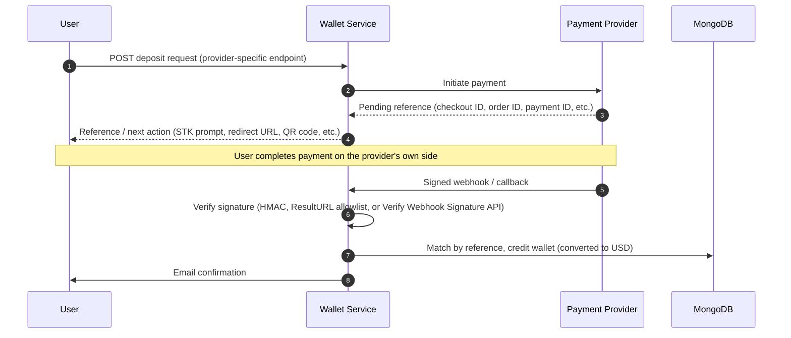
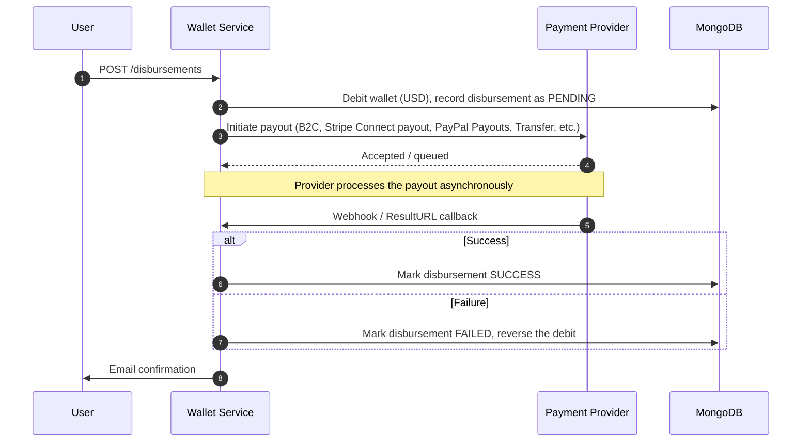
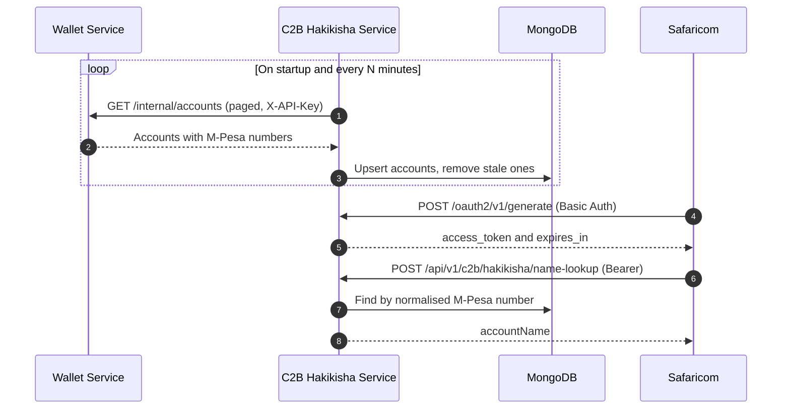

<p align="center">
  
</p>

<p align="center">
  
</p>

**A production-grade Spring Boot microservice powering digital wallets, multi-currency balances, and payment orchestration across M-Pesa, Stripe, PayPal, Flutterwave, and NOWPayments — built in Java for the Premisave fintech platform.**

<p align="center">
  <a href="https://github.com/peacemakerbill/premisave-wallet-service/stargazers"></a>
  <a href="https://github.com/peacemakerbill/premisave-wallet-service/network/members"></a>
  <a href="https://github.com/peacemakerbill/premisave-wallet-service/issues"></a>
  <a href="https://github.com/peacemakerbill/premisave-wallet-service/commits/main"></a>
</p>

<p align="center">
  
  
  
  
  
  
</p>

<p align="center">
  
  
  
  
  
</p>

<p align="center">
  <a href="https://github.com/peacemakerbill"></a>
  
  
</p>

---

## Table of Contents

- [Overview](#overview)
- [Key Features](#key-features)
- [Supported Payment Providers](#supported-payment-providers)
- [Core Concepts](#core-concepts)
  - [The Unified USD Wallet Model](#the-unified-usd-wallet-model)
  - [Live Currency Conversion](#live-currency-conversion)
  - [Commission & Company Ledger](#commission----company-ledger)
  - [Idempotency Guarantee](#idempotency-guarantee)
- [Tech Stack](#tech-stack)
- [Architecture](#architecture)
  - [Deposit Flow (All Providers)](#deposit-flow-all-providers)
  - [Disbursement / Withdrawal Flow (All Providers)](#disbursement--withdrawal-flow-all-providers)
  - [Example Integration: C2B Hakikisha Name Lookup](#example-integration-c2b-hakikisha-name-lookup)
- [Admin & Financial Reporting](#admin----financial-reporting)
- [Getting Started](#getting-started)
  - [Prerequisites](#prerequisites)
  - [Installation](#installation)
  - [Configuration](#configuration)
  - [Running the Service](#running-the-service)
- [API Overview](#api-overview)
- [Security](#security)
- [Project Structure](#project-structure)
- [Frequently Asked Questions](#frequently-asked-questions)
- [Contributing](#contributing)
- [Author](#author)
- [License](#license)

---

## Overview

**Premisave Wallet Service** is a Java Spring Boot microservice that provides digital wallet, multi-currency balance management, and payment gateway orchestration for the Premisave platform. It's the financial backbone connecting end users to five independent payment rails — **M-Pesa** (Safaricom Daraja), **Stripe**, **PayPal**, **Flutterwave**, and **NOWPayments** — behind a single, consistent, USD-denominated wallet API.

Every deposit, disbursement, transfer, and payment flows through one normalized ledger, with automatic real-time currency conversion, commission accounting, idempotent transaction processing, and full webhook-driven reconciliation — so the rest of the Premisave ecosystem never has to think about the differences between M-Pesa's STK Push, Stripe's PaymentIntents, or PayPal's Orders API.

This service exists to solve a problem every multi-provider fintech platform eventually hits: **each payment gateway has its own currency conventions, its own callback shape, its own idea of what "success" means, and its own asynchronous timing.** Rather than letting that complexity leak into every other Premisave microservice, this project absorbs it entirely — presenting one wallet, one currency, one set of transaction states, and one webhook-reconciliation pattern, regardless of which of the five providers actually moved the money.

If you're exploring **Spring Boot microservice architecture**, **fintech payment integration in Java**, **M-Pesa Daraja API integration**, **multi-currency wallet systems**, **payment gateway orchestration patterns**, or how to build a **reconciliation-safe webhook handler**, this repository is a real-world reference implementation of all of the above.

---

## Key Features

- **Unified USD Wallet** — every wallet balance is held in USD as ground truth, regardless of which currency a provider settles in, with automatic FX conversion applied consistently across deposits, disbursements, and reporting.
- **Live Exchange Rates** — scheduled background refresh from the Frankfurter API, cached in Redis and MongoDB, covering 160+ currency pairs.
- **Five Payment Providers, One API** — M-Pesa (STK Push, C2B, B2C, B2B, B2Pochi, Reversal, Account Balance, Transaction Status, Pull Transactions), Stripe (deposits, saved cards, Stripe Connect international payouts), PayPal (deposits, vaulting, Payouts API), Flutterwave v4, and NOWPayments crypto rails.
- **Wallet-to-Wallet Transfers** — instant internal transfers between Premisave users, fully commission-tracked.
- **Admin Financial Reporting** — daily finance reports, system-wide balance overviews, gateway reconciliation, and company-ledger revenue accounting (commissions, direct payment revenue, and company-side losses all normalized to USD).
- **Webhook-Driven Reconciliation** — signature-verified callback handling for every provider (HMAC, Daraja ResultURL, PayPal Verify Webhook Signature), with idempotent processing and raw-payload audit logging.
- **Automated Email Notifications** — deposit, disbursement, transfer, and payment confirmations with resolved sender/recipient names.
- **Dual Authentication Model** — JWT for end-user requests, a shared internal API key for service-to-service calls from the rest of the Premisave microservice ecosystem.
- **Rate Limiting** — token-bucket request throttling via Bucket4j.
- **Idempotency Everywhere** — every money-moving operation is protected against duplicate processing by design.
- **OpenAPI 3 Documentation** — full API spec generation via springdoc-openapi.

---

## Supported Payment Providers

| Provider | Deposits | Disbursements | Notes |
|---|:---:|:---:|---|
| **M-Pesa (Safaricom Daraja)** | Yes | Yes | STK Push, C2B, B2C, B2B, B2Pochi, Reversal, Account Balance, Transaction Status, Pull Transactions |
| **Stripe** | Yes | Yes | PaymentIntents, saved cards, Stripe Connect for cross-border payouts |
| **PayPal** | Yes | Yes | Orders API, vaulted payment methods, Payouts API |
| **Flutterwave (v4)** | Yes | Yes | Charges and Transfers |
| **NOWPayments** | Yes | Yes | Cryptocurrency deposits and payouts |

---

## Core Concepts

Understanding these four ideas is the fastest way to understand how this service is put together — every provider integration, controller, and service class in this repository is built around them.

### The Unified USD Wallet Model

Every `Wallet` document holds its balance in **USD, always** — regardless of whether the underlying transaction happened in KES (M-Pesa), a Stripe-supported settlement currency, or a cryptocurrency via NOWPayments. Conversion happens once, at the point money enters or leaves the system, using the exchange rate in effect at that moment. This means:

- A user's balance is always comparable and summable across every provider they've ever used.
- Admin reporting never has to reconcile mixed-currency totals — everything is already USD.
- Adding a sixth payment provider in the future only requires converting *that provider's* native currency to USD at the integration boundary — nothing else in the system changes.

### Live Currency Conversion

Exchange rates are sourced from the [Frankfurter API](https://www.frankfurter.app/) (backed by the European Central Bank's reference rates), refreshed on a scheduled background job, and cached in both Redis (fast path) and MongoDB (durable fallback and historical record). Over 160 currency pairs are tracked. Every previously-used currency pair is proactively refreshed on each cycle, so a rate is virtually never fetched cold on the request path.

### Commission & Company Ledger

Every money-moving operation that generates company revenue — gateway-bound disbursement commissions, internal transfer commissions, and direct payment revenue (e.g. subscription or booking-fee style payments where the *entire* amount is revenue, not a percentage cut) — is recorded as a `CompanyLedgerEntry`, always normalized to USD regardless of the originating transaction's currency. This is what powers the admin financial reports: a single, queryable source of truth for "how much did the platform actually make," broken down by source (transfers, disbursement commissions, or direct payment revenue).

### Idempotency Guarantee

Every deposit, disbursement, transfer, and payment carries a `reference` — either supplied by the caller or auto-generated as a UUID — which is checked *before* any money movement happens. Combined with the webhook-driven reconciliation model (see [Architecture](#architecture) below), this means a payment provider retrying a webhook delivery, or a client retrying a failed-looking request that actually succeeded, can never result in double-crediting or double-debiting a wallet.

---

## Tech Stack

| Layer | Technology |
|---|---|
| **Language** | Java 21 |
| **Framework** | Spring Boot 4.1.1 · Spring Framework 7 |
| **Security** | Spring Security 7 · JWT (jjwt) · JSpecify null-safety |
| **Database** | MongoDB (Spring Data MongoDB) |
| **Cache / Rate Limiting** | Redis · Bucket4j |
| **Service Communication** | Spring Cloud OpenFeign |
| **JSON Processing** | Jackson 3 |
| **API Documentation** | springdoc-openapi (OpenAPI 3) |
| **Object Mapping** | ModelMapper |
| **Build Tool** | Maven |
| **Payment SDKs** | Stripe Java SDK · OkHttp (M-Pesa Daraja) |

---

## Architecture

Premisave Wallet Service is one microservice within the larger **Premisave** platform, communicating with sibling services (auth-service, property-service, and others) via a shared internal API key over REST, and with end users via JWT-authenticated endpoints forwarded through the platform's API gateway.

```
┌──────────────┐      JWT       ┌────────────────────────┐
│   End User   │ ─────────────► │                        │
└──────────────┘                │                        │      ┌─────────────┐
                                 │   Premisave Wallet     │ ───► │  M-Pesa     │
┌──────────────┐  X-API-Key     │      Service            │ ───► │  Stripe     │
│ auth-service │ ◄────────────► │  (this repository)     │ ───► │  PayPal     │
├──────────────┤                │                        │ ───► │ Flutterwave │
│property-serv.│ ◄────────────► │  MongoDB <-> Redis     │ ───► │ NOWPayments │
└──────────────┘                └────────────────────────┘      └─────────────┘
```

Both money-moving directions — deposits and disbursements — follow the same fundamental shape across all five providers: an initiation call, an asynchronous processing period on the provider's side, and a signed webhook (or Safaricom ResultURL) callback that this service verifies and reconciles against the original transaction by its `reference`.

### Deposit Flow (All Providers)



This single shape covers M-Pesa STK Push, Stripe PaymentIntents, PayPal Orders, Flutterwave Charges, and NOWPayments crypto deposits — only the provider-specific initiation call and callback payload shape differ; the reconciliation pattern itself does not.

### Disbursement / Withdrawal Flow (All Providers)



This same shape covers M-Pesa B2C/B2Pochi/B2B, Stripe Connect payouts, PayPal Payouts, Flutterwave Transfers, and NOWPayments payouts — the wallet is debited optimistically at initiation and only ever refunded if the provider later reports failure, never left in an ambiguous state.

### Example Integration: C2B Hakikisha Name Lookup

A concrete example of the `/internal/**` API in action, beyond the generic flows above: the sibling **C2B Hakikisha** service (Safaricom's M-Pesa name-lookup API) polls this service's `GET /internal/accounts` endpoint to keep its own copy of M-Pesa/Pochi phone numbers in sync, then answers Safaricom's name-lookup requests entirely from its own local database — this service is never called synchronously in that hot path.



---

## Admin & Financial Reporting

Beyond the core wallet API, the service exposes a dedicated admin surface (role-gated: `ADMIN`, `FINANCE`, `OPERATIONS`) for platform-level financial visibility:

| Capability | What it answers |
|---|---|
| **Daily Finance Report** | Deposits, disbursements, transfers, and payment volume for a given day — plus that day's commission and direct-revenue breakdown, all in USD. |
| **System Summary** | All-time platform totals: cumulative volume per transaction type, total commission revenue, and total direct payment revenue since launch. |
| **Balance Overview** | Total wallet liability across every user, plus which wallets have which payment methods linked (M-Pesa, Pochi, PayPal, Stripe, Flutterwave). |
| **Gateway Reconciliation** | A paginated, filterable audit trail of every M-Pesa API operation (Account Balance, Transaction Status, Reversal, etc.) — including which ones never received a ResultURL callback and need manual follow-up. |
| **Manual Wallet Adjustments** | Admin-initiated balance corrections, fully audit-logged as their own ledger entry type — never a silent database edit. |

Every figure across every one of these reports is normalized to USD, even where the underlying stored records span multiple provider currencies or predate a currency-handling fix — so a report generated today reads consistently regardless of when the underlying data was originally written.

---

## Getting Started

### Prerequisites

- Java 21 (JDK)
- Maven 3.9+
- MongoDB (local or Atlas)
- Redis
- Active developer/sandbox credentials for whichever payment providers you intend to test (M-Pesa Daraja, Stripe, PayPal, Flutterwave, NOWPayments)

### Installation

```bash
git clone https://github.com/peacemakerbill/premisave-wallet-service.git
cd premisave-wallet-service
mvn clean install
```

### Configuration

All configuration is externalized via environment variables, referenced from `src/main/resources/application.yml`. Create a `.env` file (or export variables directly) covering, at minimum:

```bash
# Core
MONGODB_URI=mongodb://localhost:27017/premisave-wallet
REDIS_HOST=localhost
REDIS_PORT=6379
JWT_SECRET=your-jwt-secret
INTERNAL_API_KEY=your-shared-internal-key

# Auth Service Integration
AUTH_SERVICE_URL=http://localhost:8080

# M-Pesa Daraja
MPESA_CONSUMER_KEY=...
MPESA_CONSUMER_SECRET=...
MPESA_SHORTCODE=...
MPESA_PASSKEY=...
MPESA_CALLBACK_URL=...

# Stripe
STRIPE_SECRET_KEY=...
STRIPE_WEBHOOK_SECRET=...

# PayPal
PAYPAL_CLIENT_ID=...
PAYPAL_CLIENT_SECRET=...
PAYPAL_WEBHOOK_ID=...

# Flutterwave
FLUTTERWAVE_CLIENT_ID=...
FLUTTERWAVE_CLIENT_SECRET=...
FLUTTERWAVE_WEBHOOK_SECRET_HASH=...

# NOWPayments
NOWPAYMENTS_API_KEY=...
NOWPAYMENTS_IPN_SECRET=...
```

> See `application.yml` for the complete, documented list of environment variables and their defaults — every property there carries an inline comment explaining what it's for and where to obtain it.

### Running the Service

```bash
mvn spring-boot:run
```

The service starts on **port 8084** by default.

---

## API Overview

The service exposes REST endpoints under four broad namespaces:

| Namespace | Auth | Purpose |
|---|---|---|
| `/wallet/**` | JWT | Wallet operations, transfers, linked payment methods |
| `/payments/**` | JWT + Public webhooks | Payment initiation and provider webhook callbacks |
| `/disbursements/**` | JWT | Withdrawal/payout initiation |
| `/admin/**` | JWT (Admin/Finance/Operations roles) | Financial reporting, reconciliation, manual adjustments |
| `/internal/**` | Internal API Key | Service-to-service calls from other Premisave microservices |

Full interactive API documentation is available via OpenAPI 3 / springdoc-openapi (enable `springdoc.api-docs.enabled` / `springdoc.swagger-ui.enabled` in your own environment configuration if you need Swagger UI locally — disabled by default in this repo's shipped configuration).

---

## Security

- **JWT authentication** for all end-user-facing endpoints, validated against the platform's shared secret.
- **Internal API key authentication** (`X-API-Key` header) for service-to-service calls, kept entirely separate from user JWTs so the two trust boundaries never mix.
- **Webhook signature verification** on every payment provider callback — HMAC-SHA256 (Flutterwave), HMAC-SHA512 (NOWPayments), PayPal's Verify Webhook Signature API, and Safaricom's IP-allowlisted ResultURL model — before any transaction is trusted.
- **Role-based access control** on admin/finance endpoints (`ADMIN`, `FINANCE`, `OPERATIONS`).
- **Rate limiting** via a token-bucket algorithm to guard against abuse.
- **Stateless sessions** — no server-side session state, fully horizontally scalable.

---

## Project Structure

```
premisave-wallet-service/
├── src/main/java/com/premisave/wallet/
│   ├── config/          # Spring configuration (Security, Redis, Mongo, Feign, Rate Limiting)
│   ├── client/           # Feign clients for auth-service integration
│   ├── controller/       # REST controllers
│   ├── service/          # Business logic — one service per payment provider + core wallet logic
│   ├── dto/              # Request/response DTOs
│   ├── security/         # JWT & internal API key filters
│   ├── filter/           # Servlet filters (callback request logging, etc.)
│   └── PremisaveWalletApplication.java
├── src/main/resources/
│   └── application.yml
└── pom.xml
```

---

## Frequently Asked Questions

**Why does the wallet always store balances in USD instead of the user's local currency?**
Because five different providers settle in five different ways (KES for M-Pesa, a settlement currency for Stripe, crypto for NOWPayments), a single ground-truth currency is what makes balances comparable, summable, and reportable without per-provider special-casing. See [Core Concepts](#core-concepts).

**How does this service know a webhook hasn't already been processed?**
Every transaction carries a `reference` that's checked before any wallet mutation happens — a duplicate webhook delivery for an already-reconciled transaction is a no-op, not a double-credit.

**What happens if a disbursement's provider callback never arrives?**
Admin's Gateway Reconciliation report surfaces exactly this case for M-Pesa (see [Admin & Financial Reporting](#admin----financial-reporting)) — operations with no ResultURL response are visible for manual follow-up via Safaricom's Transaction Status API.

**Can I add a sixth payment provider?**
Yes — the deposit and disbursement flows are already provider-agnostic at the wallet-crediting/debiting level (see the [Deposit](#deposit-flow-all-providers) and [Disbursement](#disbursement--withdrawal-flow-all-providers) diagrams). A new provider needs its own initiation call, webhook signature verification, and a currency-to-USD conversion at the boundary — nothing else changes.

**Is this project open source?**
No — see [License](#license). This repository is shared publicly as a portfolio/reference implementation of the patterns involved, not as an installable open-source library.

---

## Contributing

This is a proprietary service for the Premisave platform. If you've been granted access to contribute:

1. Fork the repository
2. Create a feature branch (`git checkout -b feature/your-feature`)
3. Commit your changes with clear, descriptive messages
4. Open a pull request against `main`

---

## Author

<p align="center">
  
</p>

<h3 align="center">Bill Graham Peacemaker</h3>

<p align="center">
Backend Developer &amp; API Support Engineer at Safaricom PLC · Nairobi, Kenya
</p>

<p align="center">
Enterprise systems developer and API integration specialist, working across backend microservices (Java/Spring Boot), Flutter frontends, and DevOps — with deep, hands-on production and personal-project experience in Safaricom's M-Pesa Daraja APIs, the same integration this repository is built around.
</p>

<p align="center">
  <a href="https://github.com/peacemakerbill"></a>
  <a href="https://github.com/peacemakerbill/premisave-wallet-service"></a>
</p>

---

## License

This project is **proprietary** software developed for the Premisave platform. All rights reserved.

> *(Update this section if the project is intended to be released under an open-source license.)*

---

<p align="center">
  
</p>

<p align="center">
  <sub>Built with Spring Boot · A Premisave Platform Microservice</sub>
</p>

<!--
SEO Keywords: Spring Boot microservice, Java fintech backend, digital wallet API Java, multi-currency wallet
system, payment gateway orchestration, payment reconciliation system, wallet-as-a-service, M-Pesa Daraja API
integration Java, Safaricom Daraja Spring Boot, M-Pesa STK Push Java, M-Pesa B2C API, M-Pesa B2Pochi, M-Pesa
Hakikisha, mobile money API Kenya, Stripe Java integration, Stripe Connect payouts, PayPal API Java, PayPal
Payouts API, Flutterwave API v4 Java, NOWPayments crypto payments API, cryptocurrency payment gateway Java,
MongoDB Spring Boot microservice, Redis rate limiting Bucket4j, JWT authentication Spring Security 7,
microservice architecture Java, webhook signature verification, idempotent payment processing, fintech
backend Kenya, East Africa payments infrastructure, Premisave, financial ledger accounting system, commission
tracking system, admin financial reporting Spring Boot
-->